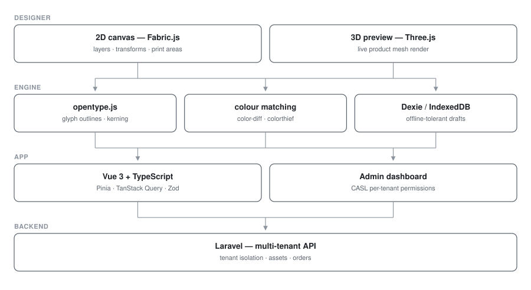

# Custimoo — Multi-Tenant Product Customisation SaaS

**Multi-tenant SaaS · Vue 3 + TypeScript · 5 repos**

A white-label product designer brands embed on their store. Customers drop artwork and text onto a physical product and see a live 3D preview before ordering. Rebuilt from Vue 2 to Vue 3 + TypeScript.

> **Source code is private.** This repository documents the architecture and engineering work.

## My role
Front-end engineer

## Architecture

| Component | v1 | v2 |
|---|---|---|
| Designer canvas | Vue 2, Fabric.js, Three.js | Vue 3 + TypeScript, Fabric.js, Three.js |
| Admin dashboard | Vue 2, CoreUI, Vuex, CASL | Vue 3, Pinia, TanStack Query |
| Backend | Laravel (multi-tenant) | Laravel (multi-tenant) |

### Service topology

## Engineering highlights

**Canvas engine.** Fabric.js for 2D layer manipulation — layering, transforms, clipping to print areas — with Three.js rendering the same design onto a 3D product mesh in real time.

**Real typography.** `opentype.js` parses font binaries directly so custom text renders with correct glyph outlines and kerning, and converts to vector paths for print output rather than rasterising.

**Colour accuracy.** `color-diff`, `colorthief` and `rgb-hex` map customer-chosen colours onto the nearest available print/thread colour — the difference between a design that looks right on screen and one that prints correctly.

**Offline-tolerant editing.** IndexedDB via Dexie persists in-progress designs client-side, so a dropped connection doesn't lose work.

**Authorisation.** CASL drives per-tenant, per-role UI permissions from a single ability definition shared between admin and designer.

**v2 modernisation.** Vue 3 Composition API + TypeScript throughout, Pinia with persisted state, TanStack Query for server-state caching, Tailwind + Reka UI for the design system, Zod + VeeValidate for schema-validated forms, Paraglide for type-safe i18n, and PostHog for product analytics.

**Production tooling.** Client-side XLSX import/export for bulk design data, jsPDF + barcode generation for order sheets, Socket.io and Laravel Echo for live admin updates.

## Screenshots

<!--  -->
<!--  -->
<!--  -->

_Screenshots pending — see `docs/README.md`._

## Stack

`Vue 3` · `TypeScript` · `Fabric.js` · `Three.js` · `opentype.js` · `Pinia` · `TanStack Query` · `Tailwind` · `Zod` · `Laravel` · `Vite` · `Dexie`
